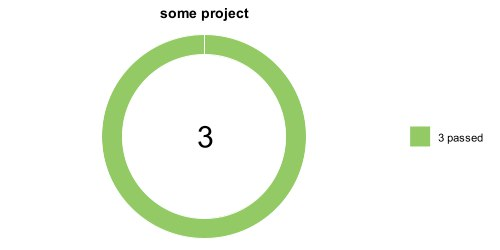

#  Проект по автоматизации тестирования сайта    


##	Содержание

- [Технологии и инструменты](#technologist-технологии-и-инструменты)
- [Реализованные проверки](#bookmark_tabs-реализованные-проверки)
- [Запуск тестов из терминала](#computer-запуск-тестов-из-терминала)
- [Запуск тестов в Jenkins](#-запуск-тестов-в-jenkins)
- [Отчет о результатах тестирования в Allure Report](#-отчет-о-результатах-тестирования-в-Allure-report)
- [Уведомления в Telegram с использованием бота](#-уведомления-в-telegram-с-использованием-бота)


## :rocket: Технологии и инструменты:
<p  align="center">


</p>

## :heavy_check_mark: Реализованные проверки:
### UI Tests

- Проверка отображения главной страницы 
- Проверка перехода на страницу 'Государственные структуры'
- Проверка перехода на Страницу 'Контакты'
- Проверка формы обратной связи(телефон, ввод букв), негативный
- Проверка ошибок в консоли


## :computer: Запуск тестов из терминала: 


 
### Локальный запуск тестов:

```bash
gradle clean test
```


### Удаленный запуск тестов:
```bash
gradle clean test
-Dbrowser=${browser}
-DbrowserVersion=${browserVersion}
-DbrowserSize=${browserSize}
-DremoteUrl=${remoteUrl}
```
## Параметры сборки:

 <strong>*browser*</strong> – браузер, в котором будут выполняться тесты (_по умолчанию - <strong>*chrome*</strong>_).

 <strong>*browserVersion*</strong> – версия браузера (_по умолчанию - <strong>*99*</strong>_).

 <strong>*browserSize*</strong> – размер окна браузера, в котором будут выполняться тесты (_по умолчанию - <strong>*1920x1080*</strong>_).

 <strong>*remoteUrl*</strong> – логин, пароль и адрес удаленного сервера Selenoid (_по умолчанию указаны в сборке Jenkins_).

## 
 Запуск тестов в [Jenkins](https://jenkins.autotests.cloud/job/CrSS/):

Для запуска сборки необходимо указать значения параметров и нажать кнопку <code><strong>*Собрать*</strong></code>.

<p align="center">
  
</p>


После выполнения сборки, в блоке <code><strong>*История сборок*</strong></code> напротив номера сборки появится
значок *Allure Report*, кликнув по которому, откроется страница с сформированным html-отчетом.

<p align="center">
  
</p>
## 
  
</p>


##  Уведомления в Telegram с использованием бота:
После завершения сборки специальный бот, созданный в <strong>Telegram</strong>, автоматически обрабатывает и отправляет сообщение с отчетом о прогоне тестов.

<p align="center">

</p>


